## Kart plugin user documentation

Below you can find some of the main functionalities of the plugin explained.

## Setup

To start using the plugin, you first have to install Kart. Download it from [here]() and install it in your system.

To configure the plugin, use the `Kart/Kart settings` menu to open the setting dialog.

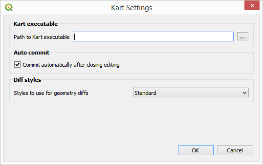

In the `Kart executable folder` field, enter the path to your Kart executable.

If the Kart folder is not configured, the Kart plugin will use the default install locations, as follows:

- **Windows**: %PROGRAMFILES%\Kart
- **OSX**: Applications/Kart.app/Contents/MacOS
- **Linux**: /opt/kart/kart

Open the Kart explorer using the `Kart/Kart explorer` menu.

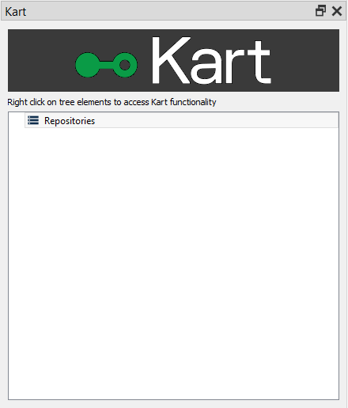

## Creating a repository

The first thing you have to do to start working with Kart is to create a repository. A repository will store all your layers and all the history of changes that you made in them.

Right-click on the `Repositories` element in the Kart explorer tree and select "Create new repository".

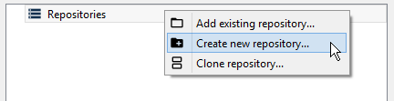

In the folder selection dialog that will appear, select the folder where you want to create your repository. The new repository will be added to the explorer tree.

Note: Kart supports different backends for repositories. All repositories created with the QGIS Kart plugin are based on GeoPackage files.

## Cloning a repository

If you want to clone a existing repository, Right-click on the `Repositories` element in the Kart explorer tree and select "Clone repository".

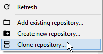

In the dialog that will appear, select the location of the repository to clone (it can be a local folder or a remote URL) and the folder where you want to store the clone.

The cloned repository will be added to the list of available repositories in the main repositories panel.

## Adding/recovering data to/from a repo

To add a layer that you want to version to a repository, right-click on the repository element in the explorer tree and select `Import layer in to repo`.

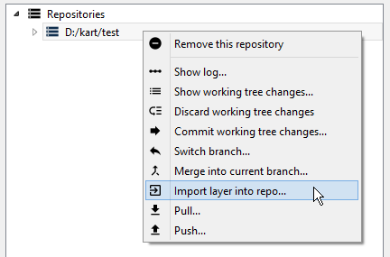

In the dialog that will show up, select the file with the layer (only vector layers) that you want to import. It will be imported into the repo and it will be shown under the `Layers` element of the repository in the explorer tree.

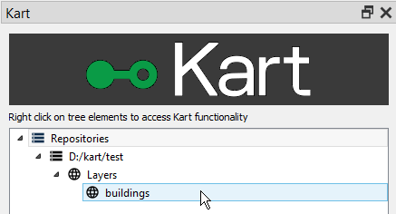

If you want to make changes to this layer and start storing its history, you can now add it to the current QGIS project. Right-click on the layer element in the explorer tree and select `Add to QGIS project`. The layer will be added to the project and you can start working with it.

## Making changes to a layer.

Work with the layer that you have just added like you would do with any other layer in QGIS. When you edit it and save your changes, they wil be stored in the corresponding GeoPackage file in the repository, and they can now be added to the layer history.

To visualize the changes that you have made to a layer since the last time that you commited to the repository (or since the time when you imported the layer, in case you haven't made any changes yet), right-click on the repository and select `Show working tree changes`. You will see something like this:

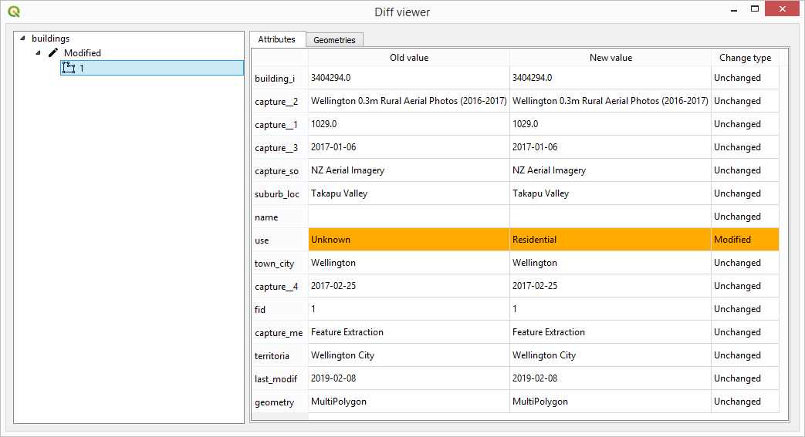

The dialog show all changes made to the repo, which might have several layers that have been modified. You can select the individual feature to see the changes that were made to both their attributes and geometry.

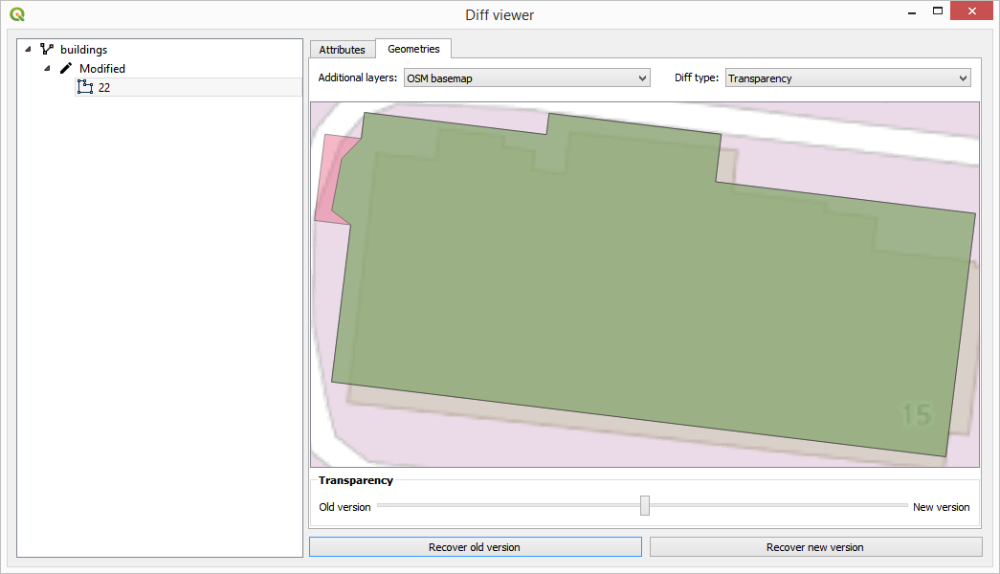

To commit the changes and create a new version in the repository, right-click on the repository element in the explorer tree and select `Commit working tree changes`. You will see the following dialog:

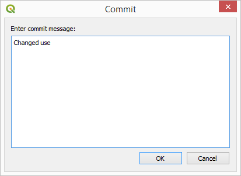

Enter the commit message to identify this set of changes, and click on `OK`

If you want the plugin to automatically commit your changes whenever you finish editing a layer in QGIS, you can enable the `Auto commit` option in the Kart settings dialog.

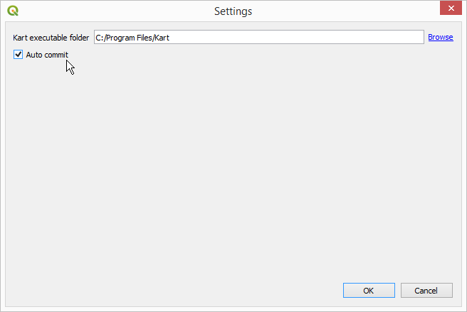

As soon as you close an editing session for a layer, a new commit with an automatic message will be created for those changes, and your working tree will never have pending changes.

## Exploring the history of a repository

To see the list of changes in the repo (for all the layers that it might contain), right-click on the repository element and select `Show log`. Youo will see a dialog like the one shown next.

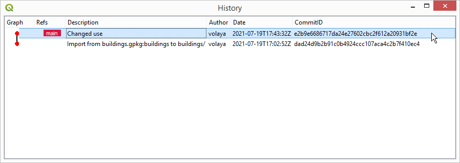

Right-clicking on the different elements representing commits you an access additional functionality. For instance, you can explore the changes introduced in each of them by selecting `Show changes for this commit`. This will open the changes dialog that we already saw in the last section.

## Working with branches.

You can create branches in the repository, to keep certains changes isolated. Branches can later be merged, to consolidate all changes together.

To create a branch at a given commit, right-click on it in the history dialog and select `Create branch at this commit`. In the dialog that will appear, enter the name for the new branch.

You will see that a new label appears now in the `Refs` column for that commit, along with the `main`label that already existed before.

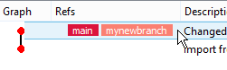

To make that branch the active one, right-click on the commit, and you will see that the context menu now has a menu named `Switch to branch '[name of your branch]'`.

The active branch is shown with a red color, while other ones are shown in salmon color.

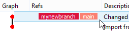

If you now make changes in the repository layers and commit them, the new commit will be added to the tip of the new active branch.

To merge any of the repository branches into the current branch, select the repository element in the explorer tree and select `Merge into current branch`. In the dialog that will appear, select the branch to merge.

If the changes in both branches are not compatible (i.e. the same feature hs been modified differently in each of them), the merge cannot be performed and you will see the following message:

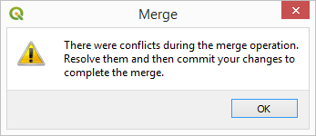

To solve the conflicts, right-click on the repository element in the explorer tree. Since the repository is conflicted, you will see that the context menu has now a different content.

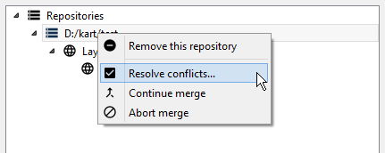

Select the `Solve conflicts` menu and you will see a dialog like the one shown below:

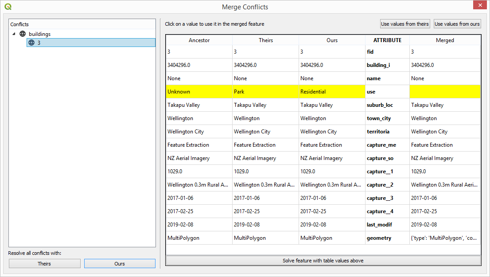

To solve the existing conflicts:

* Use the tree (left) to navigate between all the features that are in conflict.

* The main part of the panel show four version of the feature:

 - The feature, before it was modified by either person (Ancestor).

 - The feature, as modified in the current branch (Ours).

 - The feature, as modified in the branch being merged (Theirs).

 - The feature, final (resolved) version (Merged) (this is what the feature will look like *after* resolving the conflict and ending the merge operation).

* To choose a resolution for the feature:

 - Press `Use values from theirs` to fill the resolved version with the theirs version.

 - Press `Use values from ours` to fill the resolved version with the ours version .

 - Manually click on individual values to use them for the merged feature.

* When the `Merged` column has the values that you desire, click on the `Solve feature with table values above`.

* Continue solving the remaining feature conflicts.

* When all features conflicts have been resolved, the dialog will close and the merge operation will be finished.

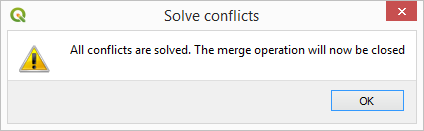

Merged branches can be clearly seen in the log dialog

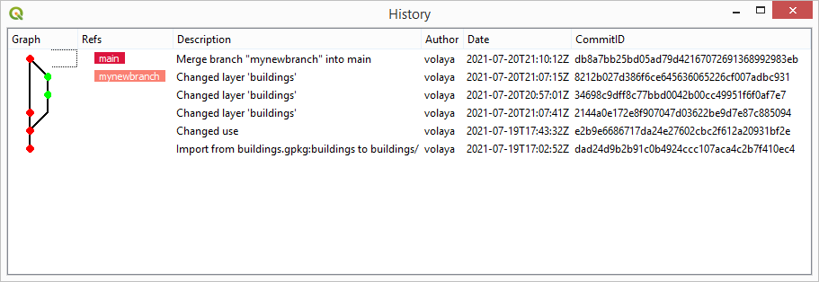
